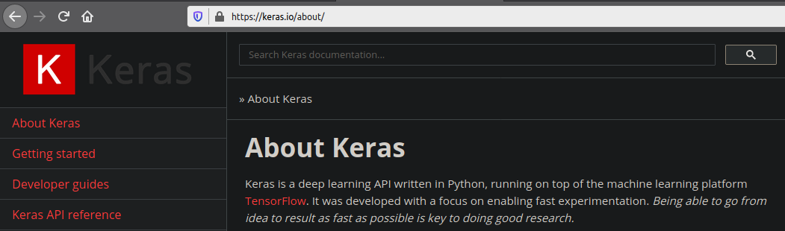

### Deep Learning with Keras  

The Keras deep learning API runs on top of the machine learning platform TensorFlow. I use Keras in my work for building classification and detection models for imagery. My experimentation with it for predictions in text and other sequences, as well as with reinforcement learning models, has made it my preferred deep learning framework.

Below are a few examples of using Keras to perform the most common deep learning tasks such as model training, model evaluation, and visualizing the activation maps of a trained convolutional neural network (convnet).
  

#### Simple CNN, the Sequential Class
Create a 2-class classification model using Keras's **Sequential** API. Train it from scratch on a small dataset.

[click here](cifar10_basic_cnn_sequential)  
  

#### Simple CNN, the Model Class
Create a 2-class classification model using Keras's **Model** API. Train it from scratch on a small dataset.

[click here](cifar10_basic_cnn_modelAPI)  
  

#### Simple CNN, subclassing the Model Class
Create a 2-class classification model by subclassing Keras's **Model** API. Train it from scratch on a small dataset.

[click here](cifar10_basic_cnn_subclassing_modelAPI)
  

#### Visualizing the Feature Maps of a Trained Model
Visualize the feature maps of the convolutional layers of the "Simple CNN" model trained above.

[click here](visualizing_feature_maps)
  

#### From Data Preparation to Model Evaluation
A simple example in two parts:

1. Train a multiclass classification model
2. Evaluate its performance using classification\_report and confusion\_matrix from sklearn.metrics

[click here](from_data_prep_to_model_evaluation) 
  

  
#### My Favorite Keras References
1. [Deep Learning with Python](https://www.manning.com/books/deep-learning-with-python-second-edition)
2. [Deep Learning for Vision Systems](https://www.manning.com/books/deep-learning-for-vision-systems)
3. [The Official Keras Website](https://keras.io/)
